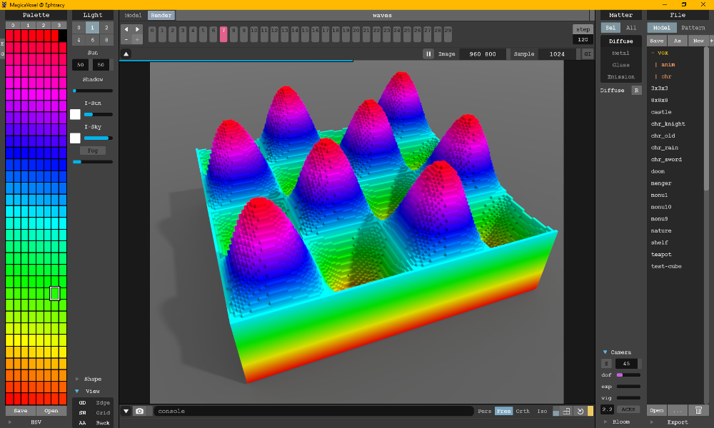

# VoxBox - O3D Modifications
The Voxel Toolbox ('VoxBox') is a Python package for working with voxel data.

## Features
* Export NumPy array as [MagicaVoxel](https://ephtracy.github.io/) file.
* Integrates with [MagicaVoxel](https://ephtracy.github.io/)

## Installation
Set $PYTHONPATH environment variable to `~/o3d/voxbox/voxbox` 

## Example
Export a NumPy array as a MagicaVoxel file. See [waves.py](examples/waves/waves.py). 
```python

# create several volumes, one for each frame 
volume_list = []
for frame in range(0, frame_count):
    
    volume = np.zeros((plane_count, row_count, col_count), dtype=np.uint8)
    
    # Create a simple heightmap (could also load something from disk)
    time_step = frame / frame_count
    heightmap = generate_waves_heightmap(col_count, row_count, time_step)

    for plane in range(0, plane_count):
        for row in range(0, row_count):
            for col in range(0, col_count):
                if plane <= height:
                    volume[plane][row][col] = solid 
                  
    # Add the new frame (volume) to the list
    volume_list.append(volume)
    
filename = "waves.vox"
voxbox.magicavoxel.write(volume_list, filename, palette)
```
    
# Result
The above code generats the following image:

